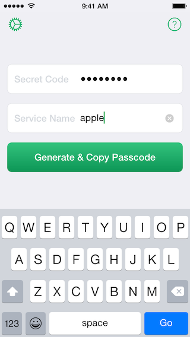

# Passcode

Generate secure, site-specific passwords from a secret master password. Since no database is used, passwords are available offline everywhere and anywhere.

---

### How to Use

**Enter the Name of the Service.**
Passcode uses the name of the service (domain) to cryptographically generate unique passwords.

**Enter your Master Password.**
This keeps your passwords secure and different from anyone else’s for the same given domain. This is only password you’ll ever need to remember.

**Generate!**
By combining the domain and master password, then running it through an encrpytion algorithm, a unique passcode is generated for you to use for that service.

---

**Secure by Design.**
Passcode was designed to be secure from the start. User information is not stored on a server. In fact, no data ever leaves the app running on the device itself.

**It’s Algorithmic.**
To generate passwords, Passcode uses a standard SHA-256 encrpytion algorithm. This means that when Passcode is given the same input, it gives the same output. Already using a generated passcode and need to retrieve it? Simply generate it again. Since the algorithm is one-way, the master password cannot be retrieved given the outputted password.

**It’s Ubiquitous.**
Since Passcode algorithmically generates passcodes, and doesn’t rely on servers and networks to sync them, all your passwords are available at all times—even when not connected to the internet.

**Available Multi-Platform.**
No matter what computing platform you’re on, Your passwords are available. Passcode is available natively for iOS, and Android. Browser extensions are available for Firefox, Chrome, and Safari. A website is available for easy access on any computer. Even a command-line application is available.

**Free & Open Source.**
The source code for Passcode, and all its applications is available for free. Because of this, Passcode will always be free and support for new platforms is easily added.